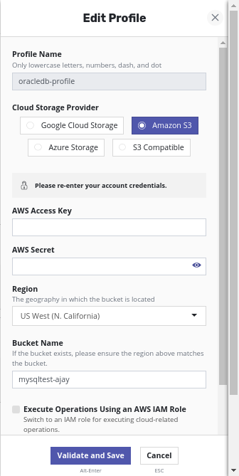
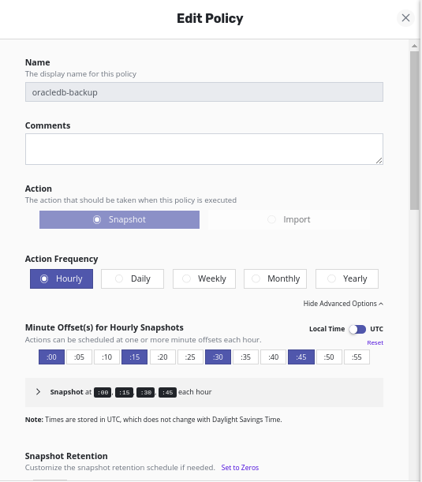
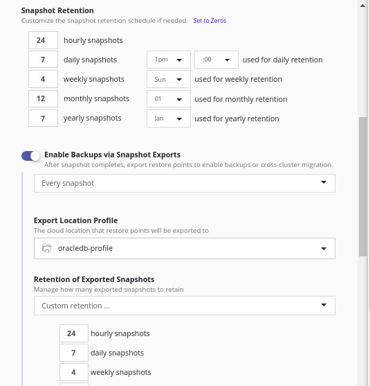
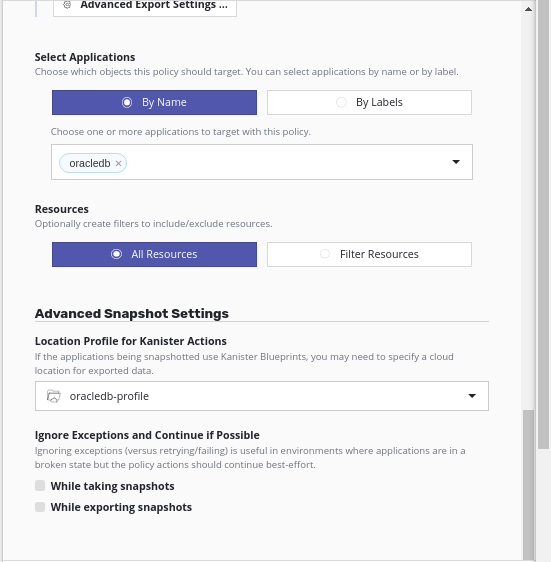
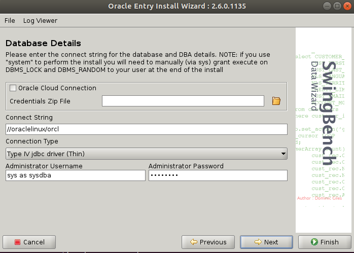
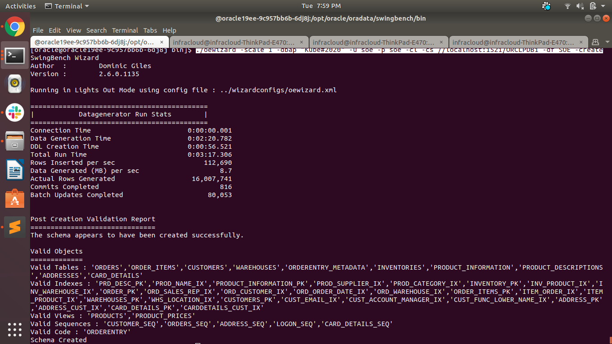
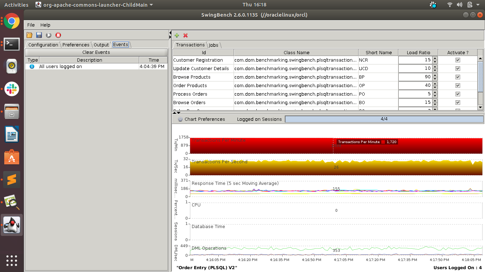

# Application Consistent Oracle Database Backup
[ORACLE](https://www.oracle.com/database/technologies/) Database is a multi-model database management system produced and marketed by Oracle Corporation. It is a database commonly used for running online transaction processing, data warehousing and mixed database workloads.

## Introduction

This Oracle database deployment on [Kubernetes](http://kubernetes.io) cluster with persistent storage.

## Installing the Oracle DB

To install the Oracle database using deployment file with differnt available 12c, 18c and 19c please refer oracle12c, oracle18ee and oracle19ee directory respecitively. 

## Integrating with K10

Make sure the Kasten(K10) application is installed in your cluster, if not please install it and refer [doc](https://docs.kasten.io/latest/install/index.html)

Once you access the K10 dashboard, create a K10 profile.
1. Go to Setting > Location > Create Location Profile
2. Provide details required, validate and save.



Now create a K10 policy for your application
1. Go to Policies
2. Create policy and give some name
3. Select action type as snapshot
4. Provide Action frequency 
5. Select the available application
6. Select Location Profile for Kanister Actions
7. Create Policy

 
 


### Create Blueprint

Create Blueprint in the same namespace as the Kanister controller

```bash
$ kubectl create -f blueprint.yaml -n kasten-io
```

Annotate the Oracle Database deployment with newly created blueprint.

```bash
$ kubectl -n {NAMESPACE} annotate deployment.apps/{DEPLOYMENT_NAME} kanister.kasten.io/blueprint={BLUEPRINT_NAME}

```

# Create a schema and run the Load

Once Oracle is running, you can populate it with some data. Let's create schema and generate some load
To generate data in Oracle database for simulating load, we are using [Swingbench](http://www.dominicgiles.com/swingbench.html). Swingbench is equipped with a utility like oewizard which loads data.
You can use SwingBench GUI from outside the pod to run the load but may lead to increase some responce time.
```bash
$ cd /opt/oracle/oradata/swingbench/bin/
$ ./oewizrd
```


# OR

```bash
#Download and copy SwingBench zip file to pod persistant volume.
$ kubectl -n NAMESPACE cp swingbenchlatest.zip {POD_NAME}:/opt/oracle/oradata/
$ kubectl -n oracle19ee exec -it pod/{POD_NAME} -- bash

#Set Java path
$ export PATH=$ORACLE_HOME/jdk/bin:$PATH

#Unzip the downloaded file
$ cd /opt/oracle/oradata/
$ unzip swingbenchlatest.zip
$ cd swingbench/bin/

# Create a schema using oewizard
$ ./oewizard -scale 1 -dbap {DB_PASSWD} -u {username} -p {password} -cl -cs //{ORACLE_DB_CONNECTION_STRING} -df '/opt/oracle/oradata/ORCL/{PDB_NAME}/{TABLESPACE_NAME}.dbf' -create
$ ./oewizard -scale 1 -dbap "Kube#2020" -u soe -p soe -cl -cs //localhost:1521/ORCL -df '/opt/oracle/oradata/ORCL/ORCLPDB1/soe.dbf' -create
```
 

# Now start the load

# concurrent number of users
$ USERS=30 	
# for five minutes
$ RUNTIME="00:05:00"
$ ./charbench -c ../configs/SOE_Server_Side_V2.xml -cs //localhost:1521/ORCL -dt thin -u soe -p soe -uc $USERS -v users,tps,tpm,dml,errs,resp -mr -min 0 -max 100 -ld   1000 -rt $RUNTIME

# Note you can change the values as per your requirement.
```
#OR
You can use Swingbench GUI app to generate load from outside the pod as well.

```bash
$ cd /opt/oracle/oradata/swingbench/bin/
$ ./swingbench
```


## Protect the Application

You can now take a backup of the Oracle data using an K10 policies for this application. Go to the K10 dashboard and run the policy.
Please note a time while running the policy to make sure the db will restored at the same point.
This will start the backup process and you can check the logs of currently running pod to see the prebackup and postbackup actions are performed.
```bash
# To check the deployment pod logs
$ kubectl -n {NAMESPACE} logs {POD} -f
```
Confirm the backup action policy ran completly in K10 dashboard.

### Restore the Application

To restore the missing data, you should use the snapshot that you created before. Let's say someone accidentally deleted some data and want to restore data to last backup point.

Go to K10 dashboard, select application restore point from which you want to restore and confirm restore.
This will start the restore process and create a new pod with the restrore point snapshot.

Confirm the restore is done completly
```bash
# Check If Pod is in ready state.
$ kubectl -n {NAMESPACE} get pods

# Once Pod is ready, connect to the DB and verify the table ORDERS last record and it should equivalent to start time.
$ kubectl -n {NAMESPACE} exec -it <POD> -- bash
$ select SYS_EXTRACT_UTC(max(order_date)) from soe.orders;
```

## Troubleshooting

If you run into any issues with the above commands, you can check the logs of the controller using:

```bash
$ kubectl --namespace kasten-io logs <KANISTER_POD_NAME>
```

## Cleanup

### Uninstalling the Deployment

To uninstall/delete the `oracle` deployment:

Please refer installtion page for the deletion of deployment. 

### Delete CRs
Remove Blueprint

```bash
$ kubectl delete blueprints oracle-blueprint -n kasten-io
```
