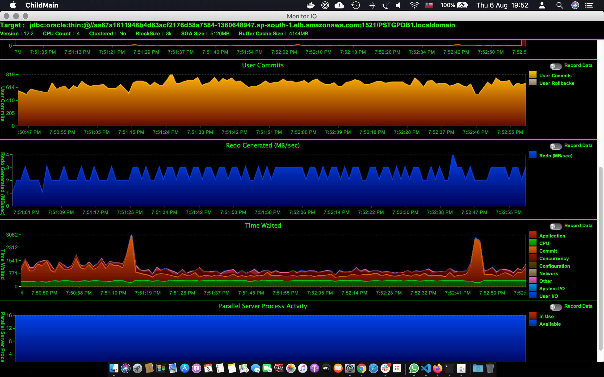

# Benchmark Oracle Backup Using Kasten

This repo contains the benchmark for Oracle Blueprint for Kasten. Oracle backup is done using third party snapshots solution provided by the Cloud provider. In the solution, we utilize Oracle's *Storage Snapshot Optimization* feature introduced in version 12c. 

Benchmark is done by simulating Application load on the database and then Using Kasten K10, snapshot backup is taken. Application load is simulated using Dominic Giles' Swingbench - Load generator framework. Swingbench comes with various benchmarks, for our testing, we have selected SOE (Order Entry PLSQL v2 benchmark). 

## Prerequisites 

* Oracle 12c or later running as Container (Kubernetes Deployment)
* Swingbench Utility copied to /ORCL/swingbench 
* Kubernetes Cluster with Kasten Installed
* Sufficiently size PV for Oracle data 


## Method

1. Generate and load data for the database using `oewizard` provided by swingbench.

```
./oewizard -scale 1 -dbap "supersecret" -u soe -p soe -cl -cs //localhost:1521/PSTGPDB1.localdomain -ts SOE -create
```

2. Create AWR Snapshot

3. Generate Load by Simulating Order Entry system

```lang=bash 

USERS=30 	# concurrent number of users
RUNTIME="00:05:00"	#  for five minutes

./swingbench/bin/charbench -c ../configs/SOE_Server_Side_V2.xml -cs //localhost:1521/PSTGPDB1.localdomain -dt thin -u soe -p soe -uc $USERS -v users,tps,tpm,dml,errs,resp -mr -min 0 -max 100 -ld   1000 -rt $RUNTIME 
```

4. Trigger snapshot from the Kasten K10 UI

5. Create AWR snapshot

6. Finish or come out of `charbench` by pressing enter. 

7. Analyze AWR reports and Summary Report of `charbench`


 
##  Results

| #   | Database Version | CPU / SGA | Users | Avg TPS | Total Tx / 5 min | Snapshot Size | Snapshot Time | Notes |
| --- | ---------------- | --------- | ----- | ------- | ---------------- | ------------- | ------------- | ----- |
| 1   | 12.2.0.1         | 4C / 5G   | 30    | 1000    | 300031           | 40G           | 00:02:33      |       |
| 2   | 12.2.0.1         | 4C / 5G   | 200   | 1075    | 322516           | 40G           | 00:04:30      |       |

## Conclusion
Below is the database performance charts showing number of commits, database time and redo generated during the test.  As you can see in the below chart, we ran a test at 7:52, Database time has a spike but there is not much impact on the number of transactions processed by the database. End user response time was intact.  The spike is mainly due to increased time taken the `log file parallel write` event for the short duration when the snapshot was taken. 


